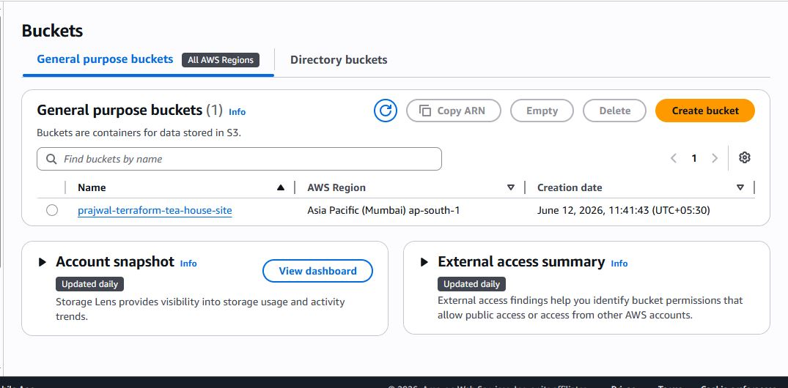
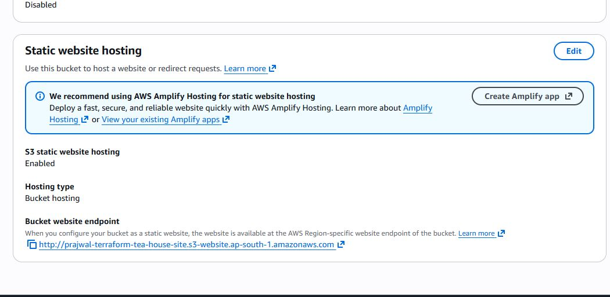
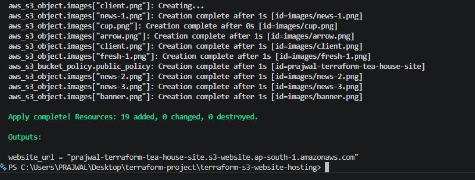

# 🏗️☁️ Terraform Automation for AWS S3 Static Website Hosting

> 🚀 Automated provisioning of AWS S3 Static Website Hosting infrastructure using Terraform and Infrastructure as Code (IaC).

## 📌 Project Overview

This project demonstrates how Terraform can be used to automate the creation and configuration of AWS resources required for hosting a static website.

The infrastructure is defined as code, making deployments repeatable, consistent, and easy to manage.

## 🏗️ Architecture

```text
👨‍💻 Terraform Code → 🏗️ Terraform Apply → ☁️ AWS S3 Bucket → 🌐 Static Website Hosting
```

## 🛠️ Tech Stack

* 🏗️ Terraform
* ☁️ AWS S3
* 🔧 Git & GitHub
* 🐧 Linux

## 🔄 Workflow

1️⃣ Write infrastructure code in Terraform.

2️⃣ Initialize Terraform using `terraform init`.

3️⃣ Review execution plan using `terraform plan`.

4️⃣ Provision AWS resources using `terraform apply`.

5️⃣ Configure S3 bucket for static website hosting.

6️⃣ Access the hosted website through the S3 website endpoint.

## 📂 Project Structure

```text
.
├── main.tf
├── variables.tf
├── outputs.tf
├── terraform.tfvars
└── README.md
```

## 📸 Project Screenshots

### ☁️ S3 Bucket Created



### 🌐 Static Website Hosting Enabled



### 🏗️ Terraform Apply



### 🌍 Website Running


## 🚀 Skills Demonstrated

✅ Infrastructure as Code (IaC)

✅ Terraform Resource Management

✅ AWS S3 Configuration

✅ Static Website Hosting

✅ Infrastructure Automation

✅ Version Controlled Infrastructure

## 🔮 Future Improvements

* ☁️ Host the website using CloudFront for better performance
* 🌍 Configure a custom domain using Route 53
* 🔒 Implement HTTPS for secure access

## 👨‍💻 Author

**Prajwal Patil**

☁️ Aspiring Cloud & DevOps Engineer
